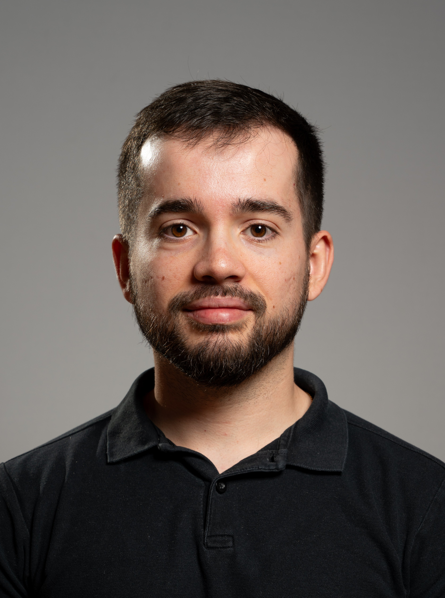

<h2>Welcome to my webpage!</h2>

  

    

    Ph.D. in Computer Science from the Université Clermont Auvergne (<a href="https://www.uca.fr" target="_blank">UCA</a>), France. My thesis, entitled "Optimization strategies for the integrated routing and inventory management problem", is available <a href="https://hal.science/tel-04941996v1" target="_blank">here</a> and the presentation <a href="/assets/files/diapo_these.pdf" target="_blank">here</a>.
    

    

    I currently work at <a href="https://www.clermont-auvergne-inp.fr/">Clermont Auvergne INP</a> as a fixed-term teaching and research assistant. I'm charged of courses for undergraduate students at <a href="https://www.uca.fr" target="_blank">UCA</a> and <a href="https://www.isima.fr" target="_blank">ISIMA</a> and I do my research at the <a href="https://limos.fr/">LIMOS</a> Laboratory.
    

    

    
    

  

  

